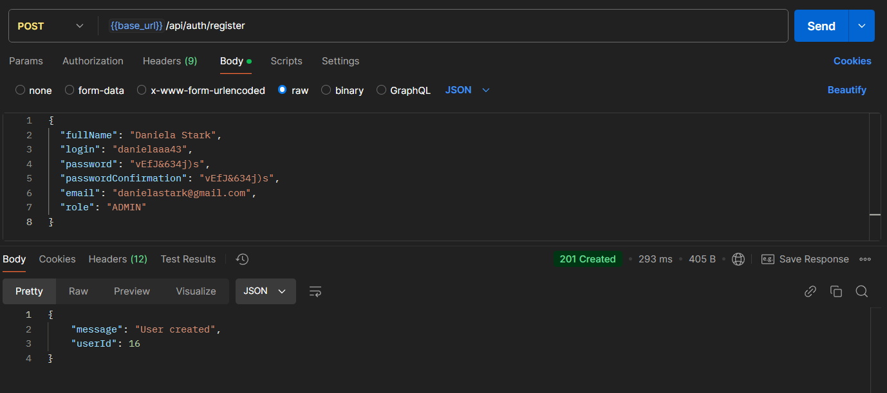
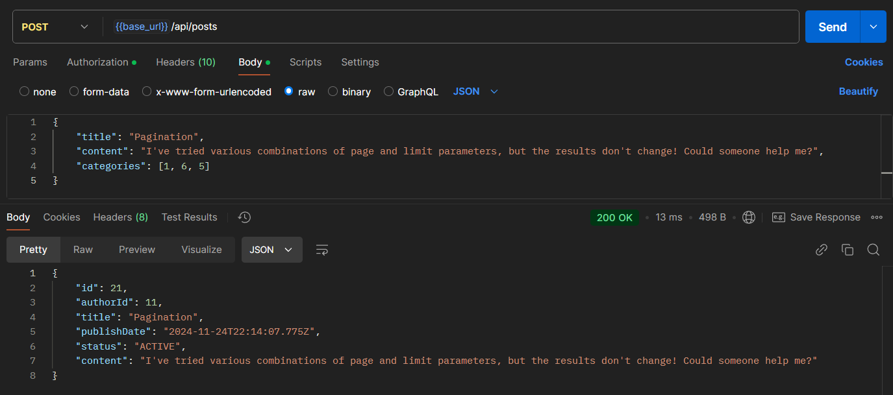
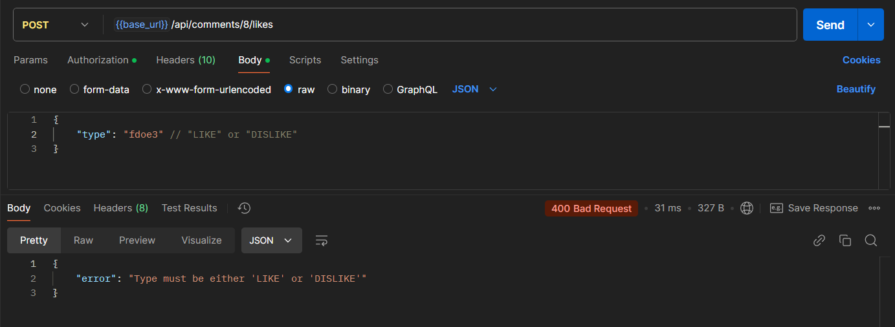

# DesignQuery

**DesignQuery** is a platform that connects designers, clients, and design enthusiasts. It provides a seamless experience for creating and managing posts, categories, and comments while enabling role-based access and interaction features like likes and dislikes.

---

# Features

## Authentication
- User registration and login.
- Password reset with secure email link.
- Role-based access control for Admins and Users.
## User Management
- Manage user profiles.
- Permissions for different user roles (Admin/User).
## Post Management
- Create, update, and delete posts.
- View all posts or filter posts by category.
## Comment Management
- Add comments to posts.
- Retrieve specific comments by ID.
- Update comment status (ACTIVE or INACTIVE).
- Delete comments (Admin or Author only).
## Category Management
- Admins can create, update, and delete categories.
- View all categories or get a specific category by ID.
- Retrieve all posts associated with a specific category.
## Likes System
- Users can like or dislike comments.
- View all likes for a specific comment.
- Delete likes (Users can only delete their own likes).
## Error Handling
- Provides detailed error messages for failed operations.
- Uses consistent HTTP status codes.
---

# Screenshots

Below are sample screenshots showing the API in use via Postman:

### 1. **User Registration**

### 2. **Post Creation**

### 3. **Error Handling**

---

# Requirements and Dependencies

## **Environment**
- **Node.js**: Version 16.x or higher
- **npm**: Version 8.x or higher
- **Database**: MySQL 8.0 or higher

## **Dependencies**
The following libraries are required to run the project:

- `express`: Fast and minimalistic web framework for Node.js
- `jsonwebtoken`: Creating and verifying JWT tokens
- `bcrypt`: Securely hashing passwords
- `prisma`: ORM for database interaction with MySQL
- `multer`: Handling file uploads
- `dotenv`: Managing environment variables
- `cors`: Handling cross-origin requests
- `morgan`: HTTP request logger middleware
- `nodemailer`: Secure and flexible email sending
- `crypto`: Generating secure tokens for sensitive operations

Refer to the `package.json` file for the full list of dependencies.

## **Database**
- **MySQL**: Relational database used to store users, posts, comments, categories, and likes

## **Authentication**
- **JWT (JSON Web Tokens)**: Stateless user authentication
- **bcrypt**: Hash and verify passwords securely

## **Other Tools**
- **Prisma CLI**: Database schema management and migrations.

---

Follow this link to access the Postman collection, where you can view all available endpoints, test their functionality, and interact directly with my server:
[Postman Collection](https://www.postman.com/descent-module-physicist-7797554/connect-fullstack-usof-backend/collection/iboqdyc/api-server?action=share&creator=38623177).
